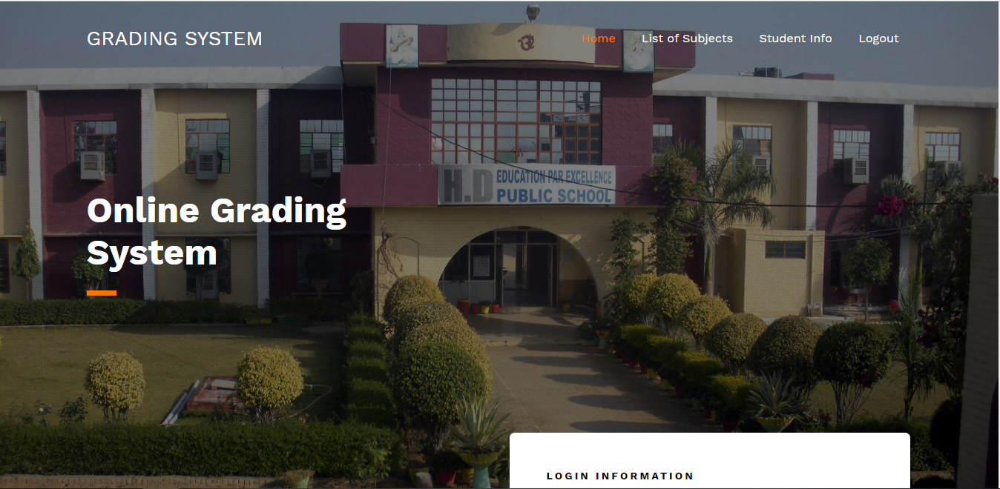

# Online Grading System Using PHP/MySQLi

### Description

This Grading System is a web-based system that it’s main goal is to allow Professors/Teachers to manage class grades and access the list of students in a school. The student can easily view their grades online through their ID number. With this, they will be able to identify what subjects they excelled in or failed.

### Features

<strong>Admin Side </strong>
<ul>
  <li><strong>Manage Students</strong></li>
  <li><strong>Manage Subjects</strong></li>
  <li><strong>Manage Grade Levels</strong></li>
  <li><strong>Manage Faculty</strong></li>
  <li><strong>Manage Departments</strong></li>
  <li><strong>Manage Rooms</strong></li>
  <li><strong>Manage Class</strong></li>
  <li><strong>Manage Student Grades</strong></li>
  <li><strong>Manage Schedule</strong></li>
  <li><strong>Manage Users</strong></li>
</ul>
<strong>Student Side</strong>
<ul>
  <li><strong>View Student Records</strong></li>
  <li><strong>View Profile</strong></li>
</ul>

Visit [sourcecodester.com](https://www.sourcecodester.com/php/13711/online-grading-system-using-phpmysqli.html) for more detailed information about this project.

### Website Info
| Title | Online Grading System Using PHP/MySQLi with Source Code |
|:---|:---|
| Website | [www.sourcecodester.com](https://www.sourcecodester.com) |
| Link | https://www.sourcecodester.com/php/13711/online-grading-system-using-phpmysqli.html |
| Language | PHP |
| Developer/Uploader | [janobe](https://www.sourcecodester.com/users/janobe) |
